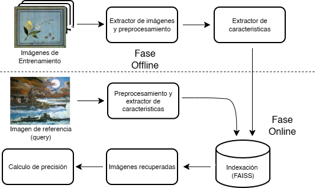

# CBIR--EquipoC

## Introducción

Este proyecto aborda el problema de la **Recuperación de Imágenes Basada en Contenido (CBIR)**. El sistema utiliza algoritmos de indexación y búsqueda eficiente mediante la librería **FAISS** (Facebook AI Similarity Search).

El objetivo es combinar y evaluar simultáneamente múltiples métodos de extracción de características para comparar su precisión y rendimiento



## 🛠️ Entorno de ejecución 

Para clonar, instalar y ejecutar este proyecto correctamente, necesitarás las siguientes herramientas y dependencias:

### 1. Requisitos de Software

Asegúrate de tener instalados:

* **Python:** Versión 3.11
* **Gestor de paquetes:** `pip` (recomendado) o `conda`.
* **Git:** Para clonar el repositorio.

### 2. Instalar Dependencias de Python

Todas las librerías necesarias se encuentran especificadas en el archivo `requirements.txt`. Ejecuta el siguiente comando en la terminal (funciona en **Windows, macOS y Linux**):

```bash
pip install -r requirements.txt
```
## 📁 Preparación del Dataset

Para ejecutar el proyecto, es necesario descargar las imágenes y organizarlas correctamente en la estructura de carpetas.

### 1. Descarga y Configuración

I.  **Descargar:** Descarga el archivo `.zip` del dataset "Art Images" desde Kaggle haciendo clic en el siguiente enlace:
    * [🔗 Kaggle - Art Images](https://www.kaggle.com/datasets/thedownhill/art-images-drawings-painting-sculpture-engraving)

II.  **Descomprimir:** Extrae el contenido del archivo `.zip`.

III.  **Organizar:** Mueve la carpeta descomprimida llamada `dataset` dentro de la carpeta `Data` de este proyecto.

### 2. Estructura del Proyecto

Para que el proyecto funcione sin errores, asegúrate de que tu directorio de trabajo tenga exactamente la siguiente estructura:

```text
CBIR--EquipoC/
│
├── Data/
│   ├── Feature/       # Carpeta para características extraídas
│   └── dataset/       # Carpeta con las imágenes 
│
├── source/
│   ├── feature_extractor.py   
│   ├── images_extractor.ipynb    
│
├── main.py            # Archivo principal de ejecución
└── requirements.txt
```

## 🚀 Ejecución del Proyecto

### 1. Extracción de Características e Indexado

Antes de poder buscar imágenes, el sistema necesita "aprender" y catalogar el dataset.

1.  Abre y ejecuta todas las celdas del notebook **`./Source/images_extractor.ipynb`**.
2.  Este script procesará las imágenes y guardará los índices vectoriales de FAISS en el directorio `./Data/Feature/`.

El sistema generará índices independientes para cada uno de los siguientes modelos:
* VGG16, ResNet50, InceptionV3, Histograma RGB y LBP (Local Binary Patterns).

> **Nota:** Dependiendo de tu hardware (CPU vs GPU) y del tamaño del dataset, este proceso puede tardar varios minutos.

### 2. Iniciar la Interfaz de Usuario

Una vez que los archivos de características se han generado, puedes iniciar la aplicación web. Ejecuta el siguiente comando en tu terminal (asegurándote de estar en la carpeta raíz del proyecto):

```bash
streamlit run main.py
```

> **Nota:** Se puedes modificar algunos parametros de images_extractor (batch, cantidad_por_clase)
